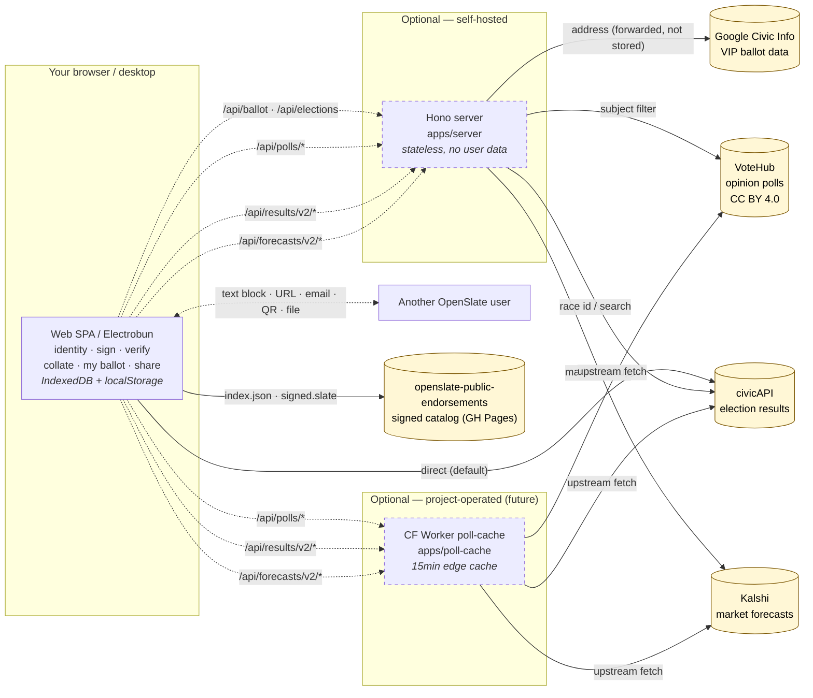

# OpenSlate

**An open standard and toolkit for sharing verifiable endorsements — and using
them to plan your own vote.**

OpenSlate lets anyone publish a tamper-evident block of endorsements — for
candidates, races, ballot measures, or any option people vote on — and share it
over *any* medium (your website, a social post, an email). Each block is a single
line of text carrying an [Ed25519](https://ed25519.cr.yp.to/) signature, so
recipients can verify it hasn't been altered and who issued it, completely
offline. Individuals, organizations, and candidates can publish both **who they
endorsed** and **who endorsed them**.

On the receiving end, the web app collates every endorsement you've imported by
race, so you can see at a glance how the orgs and people you trust line up on
each contest — and assemble **your own ballot** from sources you can verify,
alongside live polls, market forecasts, and (after polls close) results.

The goal: give citizens deeper insight into the things they care about, without
relying solely on simplified endorsements from a single newspaper or org.

> Status: **early scaffold.** The wire format and core library are the priority;
> apps are functional skeletons.

## How to Run

OpenSlate is decentralized-first: signing and verifying always happen on your
machine, never on a server. The choice below is mostly about what fetches
*public* data (ballots, polls, results) on your behalf.

### Cloud

The easy path: open the hosted web app at **TBD — not yet deployed**. Your
signing keys and slates live only in your browser; nothing is uploaded. Polls
and election results are fetched through project-operated Cloudflare Workers.
Per-address ballot lookup needs a server-side Google Civic key, so it isn't
enabled in the hosted mode — enter races manually, or self-host the Hono
backend below.

### Your Own Servers

Two pieces you can run yourself: the **static web app** (`apps/web`) and one
or more **optional backends** for ballot lookup, polls, and results. See
[Hosting topologies](#hosting-topologies) below for the architectural view.

#### Cloud (Cloudflare)

```sh
bun install
bun run build                                      # → apps/web/dist
bun run --filter '@openslate/poll-cache' deploy    # → Cloudflare Workers
```

Deploy `apps/web/dist` to Cloudflare Pages (or any static host: GitHub Pages,
Netlify, Vercel, plain S3). Build the SPA pointed at your own Worker:

```sh
VITE_POLLS_BASE=https://polls.yourdomain.dev \
VITE_RESULTS_BASE=https://polls.yourdomain.dev \
VITE_FORECASTS_BASE=https://polls.yourdomain.dev \
bun run build
```

#### Bare

Run it all locally — your laptop, a VM, a Raspberry Pi, anything with
[Bun](https://bun.sh):

```sh
bun install
bun run dev:web      # Vite SPA       — http://localhost:5173
bun run dev:server   # Hono backend   — http://localhost:8787 (optional)
```

To enable per-address ballot lookup, copy `.env.example` → `.env` and set
`GOOGLE_API_KEY`. Vite proxies `/api` → `localhost:8787` so the SPA finds the
backend automatically.

The same install gets you the CLI, for scripting or headless workflows:

```sh
# generate a keypair (keep me.identity.json secret)
bun run --filter '@openslate/cli' start -- keygen --name "Me" -o me.identity.json

# sign a set of positions
bun run --filter '@openslate/cli' start -- sign positions.json --key me.identity.json

# verify a block someone shared
bun run --filter '@openslate/cli' start -- verify "<paste block>"
```

Other useful scripts: `bun test`, `bun run typecheck`, `bun run schema`
(emits `packages/core/schema/openslate.schema.json`), `bun run lint`.

### Desktop

An [Electrobun](https://blackboard.sh/electrobun) wrapper around the web build
lives in [`apps/desktop`](./apps/desktop). Currently a stub — prebuilt
binaries are not yet published. To run from source:

```sh
bun install
bun run --filter '@openslate/desktop' dev
```

## How it works

A **slate** is a [JWS-compact](https://www.rfc-editor.org/rfc/rfc7515) token:

```
base64url(header) . base64url(payload) . base64url(signature)
```

- The **payload** is canonical JSON ([RFC 8785 JCS](https://www.rfc-editor.org/rfc/rfc8785))
  listing your positions (`endorse`, `oppose`, `lean_for`, `lean_against`,
  `neutral`, `abstain`) with optional free-text statements.
- The **signature** is Ed25519 (EdDSA / [RFC 8037](https://www.rfc-editor.org/rfc/rfc8037)).
- Your **public key is your identity** (`ed25519:<base58>`); real-world trust is a
  separate, optional layer (e.g. domain attestation via `/.well-known/openslate.json`).
- Stored as a `.slate` file or transmitted with media type `application/openslate+jws`.

See **[SPEC.md](./SPEC.md)** for the normative format, **[`vectors/`](./vectors/)**
for cross-language conformance test vectors, and
**[`docs/PORTING.md`](./docs/PORTING.md)** to reimplement the format in another
language. The standard is decentralized-first: a block is self-contained and
verifiable without any server.

## Repository layout

This is a [Bun](https://bun.sh) workspaces monorepo. Everything shares one core
library, so blocks are intercompatible across web, desktop, server, and CLI.

| Package | What it is |
| --- | --- |
| [`packages/core`](./packages/core) | `@openslate/core` — the standard's reference impl: types, schema, canonical JSON, Ed25519 sign/verify, JSON Schema export. Pure TS, minimal audited deps. |
| [`packages/cli`](./packages/cli) | `@openslate/cli` — `keygen` / `pubkey` / `sign` (incl. `--batch` for research bundles) / `validate` / `verify` / `inspect`. |
| [`apps/web`](./apps/web) | React + Vite SPA. Manage identity; compose/share/import/verify slates; browse the [public catalog](https://cinderblock.github.io/openslate-public-endorsements/); collate endorsements by race; assemble your own ballot; view live polls, market forecasts, and election results; pick per-provider direct-vs-proxy routing. Data lives in **browser storage only**. |
| [`apps/server`](./apps/server) | Minimal **stateless** Hono backend. No user data. Verify helper + proxies for ballot data ([VIP](https://www.votinginfoproject.org/) via Google Civic), opinion polls ([VoteHub](https://votehub.com)), election results ([civicAPI](https://civicapi.org)), and market forecasts ([Kalshi](https://kalshi.com)). |
| [`apps/poll-cache`](./apps/poll-cache) | `@openslate/poll-cache` — Cloudflare Worker that caches [VoteHub](https://votehub.com) polls, [civicAPI](https://civicapi.org) results, and [Kalshi](https://kalshi.com) forecasts behind permissive CORS. Mirrors the Hono server's `/api/polls/*`, `/api/results/v2/*`, and `/api/forecasts/v2/*` shapes so the web client treats either backend identically. Not yet deployed. |
| [`apps/desktop`](./apps/desktop) | [Electrobun](https://blackboard.sh/electrobun) wrapper around the web build (stub). |

## Hosting topologies

OpenSlate is **decentralized-first**: a slate is fully verifiable offline, and
the web/desktop app works against browser storage alone. The optional Hono
server and Cloudflare Worker exist only to fetch *public* data on the user's
behalf (ballot contests, polls, forecasts, election results); neither stores
user data, identity, or positions. Signing and verification always happen in
the browser.

Election results (civicAPI) already serve permissive CORS without an API key,
so the SPA hits civicAPI directly by default. Polls (VoteHub) and forecasts
(Kalshi) restrict cross-origin access, so the SPA *must* go through a proxy
for those. The Settings tab lets each user pick direct-vs-proxy per provider
where both are possible. The Hono/Worker mirrors also help self-hosters who
want a uniform fetch surface or edge caching on election night.

The web app's **Catalog** tab additionally imports pre-signed slates from a
sibling repo, [openslate-public-endorsements][ope] — published as static files
on GitHub Pages, fetched directly with no server in between.

[ope]: https://github.com/cinderblock/openslate-public-endorsements



| Mode | What runs | Sign & verify | Catalog | Polls | Forecasts | Ballot lookup | Results |
| --- | --- | :---: | :---: | :---: | :---: | :---: | :---: |
| **Pure client** (default) | Web SPA or desktop only | yes | yes (GH Pages) | — | — | manual entry | yes (civicAPI direct) |
| **+ Self-hosted Hono** | Above + your own `apps/server` | yes | yes | yes (VoteHub) | yes (Kalshi) | yes (needs `GOOGLE_API_KEY`) | yes (cached) |
| **+ Public Worker** *(future)* | Above + project-operated Worker | yes | yes | yes (cached) | yes (cached) | — | yes (cached) |

Modes are not mutually exclusive: run your own Hono for ballot lookup **and**
point `VITE_POLLS_BASE` at the public Worker for cached polls. The web client
hits `/api/polls/*` on whichever backend the env var resolves to; the response
shape is identical either way. `VITE_RESULTS_BASE` and `VITE_FORECASTS_BASE`
work the same way for civicAPI results (reached directly by default, but
configurable) and Kalshi forecasts (which always require a proxy).

## Design principles

1. **Decentralized-first.** A slate is fully verifiable offline. Servers are
   optional discovery/convenience, never required for trust.
2. **No server-side user data.** Your identity and imported slates live in your
   browser (localStorage) or files you control. The backend stores nothing.
3. **One source of truth.** Signing and the schema live only in `@openslate/core`.
4. **Reimplementable.** The format is plain JSON + Ed25519 + JCS — easy to build
   in any language. The published JSON Schema helps.

## License

[MIT](./LICENSE).
