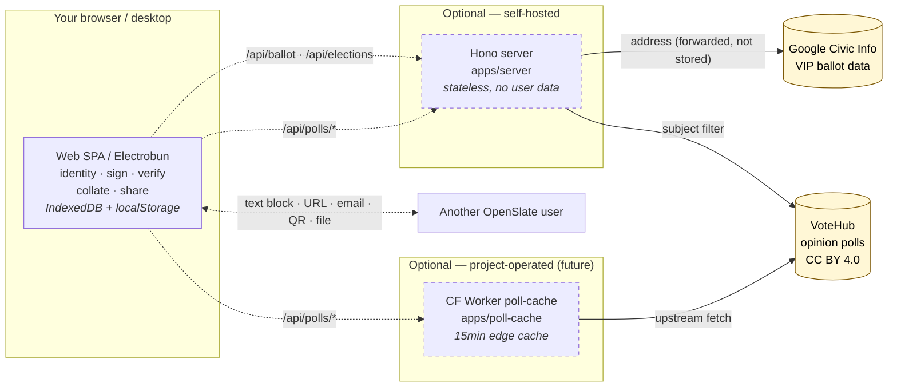

# OpenSlate

**An open standard and toolkit for securely sharing verifiable endorsements.**

OpenSlate lets anyone publish a tamper-evident block of endorsements — for
candidates, races, ballot measures, or any option people vote on — and share it
over *any* medium (your website, a social post, an email). Each block is a single
line of text carrying an [Ed25519](https://ed25519.cr.yp.to/) signature, so
recipients can verify it hasn't been altered and who issued it, completely
offline. Individuals, organizations, and candidates can publish both **who they
endorsed** and **who endorsed them**.

The goal: give citizens deeper insight into the things they care about, without
relying solely on simplified endorsements from a single newspaper or org.

> Status: **early scaffold.** The wire format and core library are the priority;
> apps are functional skeletons.

## How it works

A **slate** is a [JWS-compact](https://www.rfc-editor.org/rfc/rfc7515) token:

```
base64url(header) . base64url(payload) . base64url(signature)
```

- The **payload** is canonical JSON ([RFC 8785 JCS](https://www.rfc-editor.org/rfc/rfc8785))
  listing your positions (`endorse`, `oppose`, `lean_for`, `lean_against`,
  `neutral`, `abstain`) with optional free-text statements.
- The **signature** is Ed25519 (EdDSA / [RFC 8037](https://www.rfc-editor.org/rfc/rfc8037)).
- Your **public key is your identity** (`ed25519:<base58>`); real-world trust is a
  separate, optional layer (e.g. domain attestation via `/.well-known/openslate.json`).
- Stored as a `.slate` file or transmitted with media type `application/openslate+jws`.

See **[SPEC.md](./SPEC.md)** for the normative format and **[`vectors/`](./vectors/)**
for cross-language conformance test vectors. The standard is decentralized-first:
a block is self-contained and verifiable without any server.

## Repository layout

This is a [Bun](https://bun.sh) workspaces monorepo. Everything shares one core
library, so blocks are intercompatible across web, desktop, server, and CLI.

| Package | What it is |
| --- | --- |
| [`packages/core`](./packages/core) | `@openslate/core` — the standard's reference impl: types, schema, canonical JSON, Ed25519 sign/verify, JSON Schema export. Pure TS, minimal audited deps. |
| [`packages/cli`](./packages/cli) | `@openslate/cli` — `keygen` / `sign` / `verify` / `inspect`. |
| [`apps/web`](./apps/web) | React + Vite SPA. Manage identity, compose/share slates, import & verify, collate by race. Data lives in **browser storage only**. |
| [`apps/server`](./apps/server) | Minimal **stateless** Hono backend. No user data. Verify helper + proxies for ballot data ([VIP](https://www.votinginfoproject.org/) via Google Civic) and opinion polls ([VoteHub](https://votehub.com)). |
| [`apps/poll-cache`](./apps/poll-cache) | `@openslate/poll-cache` — Cloudflare Worker that caches [VoteHub](https://votehub.com) polls behind permissive CORS. Mirrors the Hono server's `/api/polls/*` shape so the web client treats either backend identically. Not yet deployed. |
| [`apps/desktop`](./apps/desktop) | [Electrobun](https://blackboard.sh/electrobun) wrapper around the web build (stub). |

## Hosting topologies

OpenSlate is **decentralized-first**: a slate is fully verifiable offline, and
the web/desktop app works against browser storage alone. The optional Hono
server and Cloudflare Worker exist only to fetch *public* data on the user's
behalf (ballot contests, polls); neither stores user data, identity, or
positions. Signing and verification always happen in the browser.



| Mode | What runs | Sign & verify | Polls | Ballot lookup |
| --- | --- | :---: | :---: | :---: |
| **Pure client** (default) | Web SPA or desktop only | yes | manual entry | manual entry |
| **+ Self-hosted Hono** | Above + your own `apps/server` | yes | yes (VoteHub) | yes (needs `GOOGLE_API_KEY`) |
| **+ Public Worker** *(future)* | Above + project-operated Worker | yes | yes (cached) | — |

Modes are not mutually exclusive: run your own Hono for ballot lookup **and**
point `VITE_POLLS_BASE` at the public Worker for cached polls. The web client
hits `/api/polls/*` on whichever backend the env var resolves to; the response
shape is identical either way.

## Quickstart

```sh
bun install

# generate a keypair (writes ./me.identity.json — keep it secret)
bun run --filter '@openslate/cli' start -- keygen --name "Me" -o me.identity.json

# sign a set of positions into a shareable block
bun run --filter '@openslate/cli' start -- sign positions.json --key me.identity.json

# verify a block someone shared with you
bun run --filter '@openslate/cli' start -- verify "<paste block>"

# run the web app
bun run dev:web

# run the (optional) backend
bun run dev:server
```

Other useful scripts: `bun test`, `bun run typecheck`, `bun run schema`
(emits `packages/core/schema/openslate.schema.json`), `bun run lint`.

## Design principles

1. **Decentralized-first.** A slate is fully verifiable offline. Servers are
   optional discovery/convenience, never required for trust.
2. **No server-side user data.** Your identity and imported slates live in your
   browser (localStorage) or files you control. The backend stores nothing.
3. **One source of truth.** Signing and the schema live only in `@openslate/core`.
4. **Reimplementable.** The format is plain JSON + Ed25519 + JCS — easy to build
   in any language. The published JSON Schema helps.

## License

[MIT](./LICENSE).
